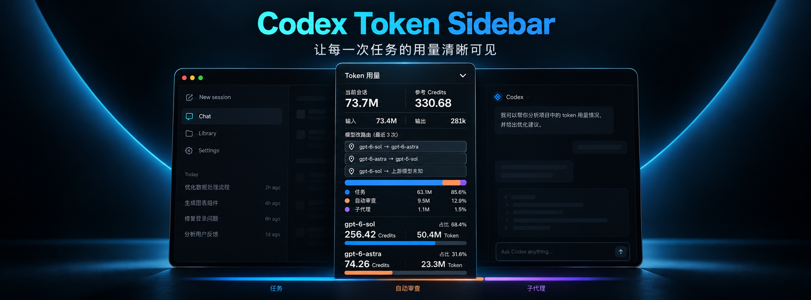
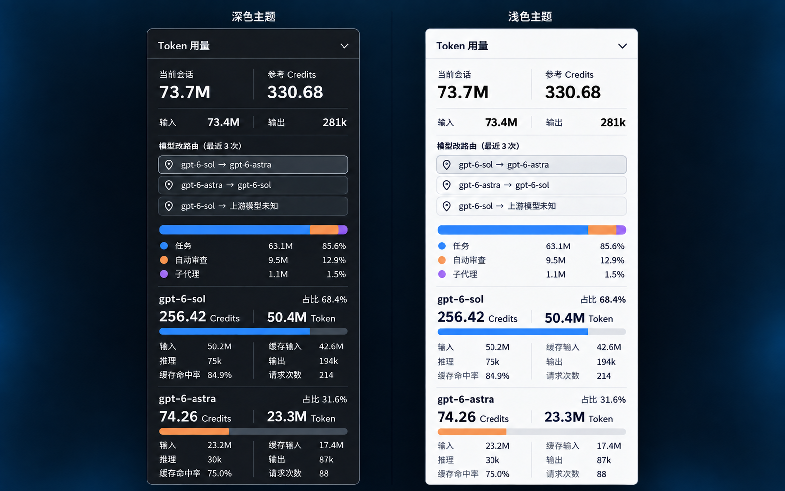

# Codex Token Sidebar



**看清每一次 Codex 任务的用量，也看清用量从哪里来。**

Codex Token Sidebar 是面向 macOS 和 Windows 版 Codex Desktop 的 Token 用量面板。它跟随当前选中的任务，把这次任务及关联子任务的用量汇集在侧栏。长对话、多个模型、自动审查和子代理交织在一起时，你仍能随手展开面板，看清总量、来源和每个模型的投入，不必等任务结束再回头整理。



## 一个面板，读懂整次任务

- **掌握全貌：** 当前会话的总 Token 与参考 Credits 并排呈现，输入和输出用量一眼可见。参考 Credits 按公开费率估算会话累计，让用量规模更容易把握。
- **找到来源：** 用一条分段图和对应占比区分任务、自动审查与子代理的消耗，快速看到主要用量来自哪里。
- **比较模型：** 每个模型都有独立的 Token 与参考 Credits 小计，同时展示占比、输入、缓存输入、推理、输出、缓存命中率和请求次数。多模型协作时，投入差异清清楚楚。
- **费率自动更新：** 定期同步 OpenAI [官方定价](https://learn.chatgpt.com/docs/pricing)中的模型 Credits 费率；新模型在官方模型目录和费率表中公布后，也会自动纳入估算，日常价格更新无需手动维护。
- **回到关键轮次：** 发生模型改路由时，面板列出最近三次记录；点击对应卡片，即可回到这次变化发生的轮次。

> **Beta 提示：** 模型改路由功能仍在测试阶段。我目前缺少能触发真实改路由的账号，因此路由识别和轮次定位可能有遗漏或偏差。如果你发现与实际情况不符，欢迎在 [Issues](https://github.com/StephenAll/codex_token_sidebar/issues) 反馈。

一次长任务里，自动审查或子代理接手工作后，先看功能分布，就能知道新增用量落在哪个环节；再看模型明细，便能比较不同模型的占比和参考 Credits。需要复盘改路由时，卡片又能把你带回发生变化的那次回复。切换任务，面板也会随之更新，让这些判断始终围绕眼前的工作。


## 开始使用

在 Codex 桌面版中新建任务，发送下面这句话，让 Codex 按[安装指南](INSTALL.md)完成设置：

```text
请克隆 https://github.com/StephenAll/codex_token_sidebar 并进入仓库根目录，阅读 INSTALL.md，按我电脑的 macOS 或 Windows 系统安装并启动 Codex Token Sidebar，最后确认 Codex Desktop 侧栏出现“Token 用量”；需要我亲自完成的步骤请直接告诉我。
```

安装后，打开一个已有用量的任务，在固定摘要侧栏展开“Token 用量”，即可查看该任务的统计。

## 数据留在本机

会话用量在本机读取和汇总。插件更新公开费率时，不会上传会话内容、账号凭据或用量明细。

## 参与项目

欢迎通过仓库 Issue 提供反馈：说明 Codex Desktop 与操作系统版本、复现步骤、预期和实际结果。提交截图或日志前，请遮盖任务标题、路径和账号信息；不要上传原始会话 JSONL、提示词或完整 CDP 数据。

项目使用 [MIT 许可证](LICENSE)。
